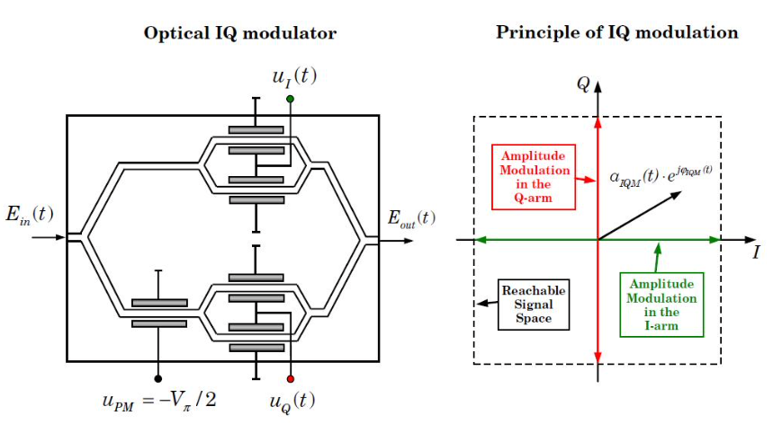

# Optical fiber WDM System simulation
##  1. 信号处理基础
---
### 1.0 频谱
#### 1.0.1 无限区间上函数的**频谱**：
对于无限连续信号 $x(t),t\in (-\infty, +\infty)$
$$
X(f) = \int_{-\infty}^{+\infty} x(t) e^{-i2\pi ft} dt \\
x(t) = \int_{-\infty}^{+\infty} X(f) e^{i2\pi ft} df
$$
$X(f)$称为$x(t)$的频谱.

---
#### 1.0.2 有限区间上函数的**离散频谱**
对于有限连续信号 $x(t),t\in[t_0,t_0+T]$
$$
c_n = \frac{1}{T} \int_{t_0}^{t_0+T} x(t) e^{-i2\pi nf_0 t} dt \\
x(t) = \sum_{n= -\infty}^{+\infty} c_n e^{-2\pi n f_0 t}, \ f_0 =\frac{1}{T} 
$$
$c_n$称为$x(t)$在区间$[t_0,t_0+T]$上的离散频谱.

---

#### 1.0.3 无限离散信号的**频谱**：
对于无限离散信号 $x(n\Delta)， n\in \mathbb{Z}$
$$
X_{\Delta}(f) = \Delta \sum_{n=-\infty}^{+\infty} x(n\Delta) e^{-i2\pi n\Delta f} \\
x(n\Delta) = \int_{-\frac{1}{2\Delta}}^{+\frac{1}{2\Delta}} X_{\Delta}(f)e^{i2\pi n \Delta f} df
$$
$X_{\Delta}$称为离散信号$x(n\Delta)$的频谱，是一个周期为$\frac{1}{\Delta}$的函数，只有在$[-\frac{1}{2\Delta}, + \frac{1}{2\Delta}]$上的取值与连续信号的物理意义一致.

---
#### 1.0.4 有限离散信号的**频谱**：
对于有限离散信号 $x(n\Delta), (0\leq n\leq N-1)$.
$$
X(f) =  \sum_{n=0}^{N-1} x(n\Delta) e^{-i2\pi n\Delta f}
$$
与无限情况只差一个scale.

---
#### 1.0.5 有限离散信号的有限离散频谱:
对于有限离散信号 $x(n\Delta), (0\leq n\leq N-1)$.在频谱上均匀采$N$个点，就得到**有限离散频谱**.

为了数学上处理的方便,我们在周期$[0,\frac{1}{\Delta}]$上采点。
$$
f_m = \frac{m}{N\Delta} = m d
$$
$X(f_m), (0\leq m \leq N-1)$为有限离散频谱， $d = \frac{1}{N\Delta}$ 为**基频**.这样就得到了离散傅里叶变换(DFT)
$$
X(f_m) = \sum_{n=0}^{N-1} x(n\Delta) e^{-inm\frac{2\pi}{N}} \\
x(n\Delta) = \frac{1}{N} \sum_{m=0}^{N-1} X(f_m) e^{inm\frac{2\pi}{N}}
$$
---
### 抽样定理：
假设在1.0.3中我们的无限离散信号采样于某个连续信号$x(t)$. 采样得到的离散信号的频谱与原来连续信号的的频谱有什么关系呢？采样定理回答了这个问题。

假设有无限连续信号$x(t)$，对应无限离散信号为$x(n\Delta)$, 则相应的频谱有如下关系：
$$
X_{\Delta}(f) = \sum_{m=-\infty}^{+\infty} X(f + \frac{m}{\Delta})
$$
特别的，当 $\frac{1}{\Delta} > 2f_c$ 时， $X_{\Delta}(f) = X(f)$. 其中$f_c$为信号的**截频**，也即当$|f|\geq f_c$时满足$X(f)=0$.

**倘若一个信号的截频为无穷大，我们需要先做低通滤波将高频成分滤掉再做抽样，这样可以避免”假频“现象.**

---
### 有限离散频谱定理 
$x(n\Delta) ， n\in \mathbb{Z}$的频谱为$X_{\Delta}(f)$, 有限离散谱为$X_{\Delta}(f_m)$, 该离散谱对应离散信号$x_d(n\Delta)$.
则有
$$
x_d(n\Delta) = \sum_{k\in\mathbb{Z}} x((n+kN)\Delta)
$$

--- 
### FT 性质 (连续)
Fourier 算符 $\mathcal{F}: L^1(R) \rightarrow L^{1}(R)$
$$
\mathcal{F}(x)(f) = X(f) := \int_{-\infty}^{+\infty} x(t) e^{-i2\pi ft}dt
$$

卷积算符 $*: L^1(R) \times  L^1(R) \rightarrow L^{1}(R)$
$$
(x*y)(t) = \int_{-\infty}^{+\infty} x(\tau) y(t-\tau) d\tau
$$

对称算符 $P: L^1(R) \rightarrow L^{1}(R)$
$$
P(x)(t) = x(-t)
$$

共轭算符 $C: L^1(R) \rightarrow L^{1}(R)$
$$
C(x)(t) = \bar{x}(t)
$$


1. **卷积定理**
$$
\mathcal{F}(x*y) = \mathcal{F}(x) \cdot \mathcal{F}(y) \\
\mathcal{F}(x\cdot y) = \mathcal{F}(x) * \mathcal{F}(y) 
$$

2. **对称定理，翻转定理**
$$
\mathcal{F}^2 = P, \mathcal{F}^4 = id, \mathcal{F}^{-1} = P\mathcal{F}, \mathcal{F} P = P\mathcal{F}
$$

3. **共轭定理**
$$
\mathcal{F}(\bar{x}(t)) = \overline{X(-f)}
$$
也可写成
$$
\mathcal{F}\circ C = C\circ P \circ \mathcal{F}
$$

4. **时移定理**
$$
\mathcal{F}(x(t-t_0)) = X(f)e^{-i2\pi ft_0}
$$

5. **频移定理**
$$
\mathcal{F}(x(t)e^{2\pi i f_0 t}) = X(f - f_0)
$$

6. **展缩定理**
$$
\mathcal{F}(x(at)) = \frac{1}{|a|} X(\frac{f}{a}) \\
\mathcal{F}^{-1}(X(af)) = \frac{1}{|a|} x(\frac{t}{a})
$$

7. **时域微分定理**
$$
\mathcal{F}(\frac{d^n}{dt^n }x) = (2\pi f i)^n X(f)
$$

8. **频域微分定理**
$$
\mathcal{F}^{-1}(\frac{d^n}{df^n} X(f)) = (-2\pi i t)^n x(t)
$$

---
### FT 重要例子
### 表格
| 时域     | 频域 |
| ----    | ---- |
| $1$ | $\delta(f)$ |
| $\delta(t)$| $1$ |
| $e^{i2\pi f_0t}$ | $\delta(f - f_0)$ |
| $\delta(t - t_0)$ | $e^{-i2\pi f t_0}$ |
| $(-2\pi it)^n$ | $\delta^{(n)}(f)$ |
| $\delta^{(n)}(t)$ | $(2\pi i f)^n$ |
| $rect(t)$ | $sinc(f)$ |
| $sinc(t)$ | $rect(f)$ |
| $tri(t)$  | $sinc^2(f)$ |
| $sinc(t)$ | $tri(f)$ |
|$\sum_{n=-\infty}^{\infty} \delta(x-n T)$ | $\frac{1}{T}\sum_{k=-\infty}^{\infty} \delta\left(f-\frac{k}{T}\right)$|
| $e^{-\pi t^2}$ | $e^{-\pi f^2}$|
|$e^{-i\alpha t^2}$| $\frac{\pi}{\alpha} \cdot e^{-\frac{\pi i}{4}} e^{i\frac{\pi^2f^2}{\alpha}}$
$$
\operatorname{rect}(t)=\Pi(t)=\left\{\begin{array}{ll}
0, & \text { if }|t|>\frac{1}{2} \\
\frac{1}{2}, & \text { if }|t|=\frac{1}{2} \\
1, & \text { if }|t|<\frac{1}{2}
\end{array}\right.  \quad 
sinc(x) = \frac{\sin(\pi x)}{\pi x} \quad
tri(x) = max(1-|x|,0)
$$
最后两条可以通过求导证明：
$$
x(t) = e^{-\pi t^2} \\
x'(t) = -2\pi t x(t) \\
2\pi i f X(f) = -2\pi \frac{1}{-2\pi i } X(f)' \\
X'(f) = -2\pi f X(f) \\
X(f) = C\exp(-\pi f^2)
$$
---
### 1.1 线性卷积（全卷积）
$x[n],y[n]$ 是两个离散序列。
$$
z = x*y
$$
$$
z[n] = \sum_{i=-\infty}^{+\infty} x[i]\cdot y[n-i]
$$
在计算机中，一般假设x,y是一个下标起点为0的有限长向量，那么两者卷积的结果也是一个下标起点为0，长度为 $len(x) + len(y) - 1$的向量.
```python
from scipy.signal import convolve
x = np.arange(4)
y = np.arange(3)
convolve(x,y)
```
```python
array([0, 0, 1, 4, 7, 6])
```

---
### 1.2 周期卷积($mod \ N$)
$x[n],y[n]$ 是两个长度为 $N$ 的离散序列。
$$
z = x *_{N} y
$$
$$
z[n] = \sum_{i=0}^{N-1} x[i]y_N[n-i] 
$$

### 1.3 快速傅里叶变换
- FFT:
  
对任意长为N的有限序列 $x = [x_0,x_1,...,x_{N-1}]$,可以定义离散傅里叶变换：$\mathcal{F}_N:C^N\rightarrow C^N$
$$
X = \mathcal{F}_N(x) := [X_0,X_1,...,X_{N-1}]
$$

$$
X_k = \sum_{i=0}^{N-1}x_i\omega^{ki}
$$
其中 $\omega = e^{-\frac{2\pi i}{N}}$为N次单位根.
- IFFT

我们可以直接先出 $\mathcal{F}_N$ 的逆变换: $\mathcal{F}^{-1}_{N}: C^N\rightarrow C^N$
$$
x = \mathcal{F}^{-1}_{N}(X)
$$

$$
x_i := \frac{1}{N}\sum_{k=0}^{N-1}X_k\omega^{-ki}
$$ 

---
### 1.4 DFT 性质
1. **重建定理**
$$
\mathcal{F}_N^{-1}(\mathcal{F}_N(x)) = x
$$

---
2. **离散卷积定理**([See here](https://en.wikipedia.org/wiki/Convolution_theorem#Functions_of_discrete_variable_sequences))
$$
\mathcal{F}_N(x *_N y) = \mathcal{F}_N(x) \cdot \mathcal{F}_N(y)
$$

$$
\mathcal{F}_N^{-1}(x \cdot y) = \mathcal{F}_N^{-1}(x) *_N \mathcal{F}^{-1}_N(y)
$$

利用这两个定理我们可以利用FFT和IFFT实现周期卷积，然后只要在周期卷积上补充0即可得到全卷积
- 周期卷积
$$
x *_N y = \mathcal{F}^{-1}(\mathcal{F}(x) \cdot \mathcal{F}(y))
$$
```python
import numpy as np
fft =  np.fft.fft
ifft = np.fft.ifft
def cirv_conv(x,y):
    return ifft(fft(x)*fft(y))
```
- 全卷积

```python
from scipy.signal import convolve
def full_conv(x,y):
    L = len(x) + len(y) - 1
    x_pad = np.concatenate([x,np.zeros(L-len(x))])
    y_pad = np.concatenate([y,np.zeros(L-len(y))])
    return cirv_conv(x_pad,y_pad)

x = np.arange(10)
y = np.arange(5)
np.sum(np.abs(full_conv(x,y) - convolve(x,y)))
```

```python
8.243618233799728e-14
```
---

3. **翻转定理**

定义翻转算子：$P: C^N \rightarrow C^N$
$$
x = [x_0,x_1,...,x_{N-1}]  = [x_i]\\ 
P(x) = [x_0,x_{N-1},x_{N-2},...,x_{1}] = [x_{N-i}]
$$
则有翻转定理：
$$
\frac{1}{N}\mathcal{F}_N\circ \mathcal{F}_N = P,  \frac{1}{N^2}\mathcal{F}^4 = id\\
\mathcal{F}_N^{-1} = \frac{1}{N} P \circ \mathcal{F} = \frac{1}{N} \mathcal{F}\circ P
$$

4. **共轭定理**
$$
\mathcal{F}_N(\bar{x}) = \overline{P\circ \mathcal{F}_N(x)}
$$

5. **时移定理**
$$
\mathcal{F}_N(x_{i-i_0})_k = X_ke^{-\frac{i2\pi}{N}i_0k}
$$

6. **频移定理**

$$
\mathcal{F}_N\left(\left\{x_{n} \cdot e^{\frac{i 2 \pi}{N} n m}\right\}\right)_{k}=X_{k-m}
$$

### 1.5 使用FFT做频谱分析
时域信号连续模型:
$$
x(t), t\in[0,+\infty)
$$
<p align="center">

</p>
离散信号模型：
<p align="center">

</p>

$$
x = [x_0,x_1,...,x_{N-1}], x_i = ih, h=\frac{T}{N}
$$
- **sampling rate**:   $\frac{N}{T}$
- **time step**:    $\frac{T}{N}$
- **fft frequences**: $f = \frac{1}{T}[0, 1, ...,   N/2-1,     -N/2, ..., -1]$
- **fft angular frequences**: $\omega = 2\pi f$
  
$h,N$ 选取的标准:
- 设信号$x(t)$ 的截频为$f_c$.
- $x(t)$的频率分辨间隔为$f_{\delta}$

则$h,N$需要满足以下条件：
- 采样定理告诉我们：
$$
\frac{1}{h} > 2f_c \Rightarrow h < \frac{1}{2f_c}
$$

- 频率分辨率的存在要求我们必须让**基频**不高于频率分辨间隔
$$
\frac{1}{Nh} < f_{\delta} \Rightarrow N > \frac{1}{f_{\delta} h} \Rightarrow N > \frac{2f_c}{f_{\delta}}
$$

- 有限离散的信号要能近似代替原始的无限离散信号

$$
\frac{\sum_{n=0}^{N-1} x(nh)^2}{\sum_{n=0}^{\infty} x(nh)^2} \approx 0
$$

综合第二条可知
$$
T = Nh > \frac{1}{f_{\delta}}
$$
右边的值被称为**最小记录长度**.

```python
import matplotlib.pyplot as plt
T = 5
N = 100
t = np.linspace(0,T,N,endpoint=False)
x = np.exp(-(t-0.5*T)**2*10)
f = np.fft.fftfreq(len(x),d=T/N)
w = 2*np.pi*f
```
使用fft获得时间信号的频域表达
```python
import matplotlib.pyplot as plt
xf = np.fft.fft(x)
xf_shift = np.fft.fftshift(xf)
```
<p align="center">

</p>

在上面的 xf 中,频率分量的成分是按照前文中获得的 f 组织的，如果想要获得正常从递增的频率成分排序，可以使用fftshift函数将f中**左右两半的频率成分交换**，将频域整理成正常的顺序.
```python
T = 5
N = 10
t = np.linspace(0,T,N,endpoint=False)
x = np.exp(-(t-0.5*T)**2*10)
f = np.fft.fftfreq(len(x),d=T/N)
w = 2*np.pi*f
print(f)
print(np.fft.fftshift(f))

[ 0.   0.2  0.4  0.6  0.8 -1.  -0.8 -0.6 -0.4 -0.2]
[-1.  -0.8 -0.6 -0.4 -0.2  0.   0.2  0.4  0.6  0.8]
```

```python
## 信号处理基础
fft = np.fft.fft
ifft = np.fft.ifft
shift = np.fft.fftshift
freq = np.fft.fftfreq

### FFT 做频谱分析
N = 400
h = 0.01
t = np.linspace(-0.5 * N*h,0.5*N*h,N)
x = (np.abs(t) < 0.5)*1.0
f = freq(N, h)
omega = 2*np.pi*f
xf = fft(shift(x))*h   # 使用fft计算离散信号的频谱 (需要shift 因为fft默认信号时间从0开始)

fs = shift(f)
xfs = shift(xf)

d = int(0.5*N- 20 * N * h)   ## 展示 【-20,20】Hz
plt.plot(fs[d:-d],np.sinc(fs)[d:-d])
plt.plot(fs[d:-d],xfs[d:-d])
plt.plot(fs[d:-d],xfs.imag[d:-d])
plt.plot(fs[d:-d],xfs.real[d:-d])
```

<p align="center">

</p>

#### 时域平移 vs 频域相位旋转
$$
\mathcal{F}^{-1}(\mathcal{F}(u) \cdot \exp(-j\omega \tau))(t) = u( t - \tau)
$$
```python
## 时域平移 vs 频域相位旋转
import matplotlib.pyplot as plt
T = 5
N = 100
t = np.linspace(0,T,N,endpoint=False)
x = np.exp(-(t-0.5*T)**2*10)
f = np.fft.fftfreq(len(x),d=T/N)
w = 2*np.pi*f

T = 1
x1 = ifft(fft(x) * np.exp(-1j*w*T)).real
plt.plot(t, x,'-*',label='original')
plt.plot(t, x1,'-+' ,label='after')
plt.legend(loc='best')
plt.xlabel('t')
plt.ylabel('x')
```
<p align="center">

</p>

---

### 1.6 单位换算
- 时间单位
$$
1\ s = 10^3\ ms = 10^6\ \mu s = 10^9\ ns = 10^{12}\ ps
$$
- 空间单位
$$
1\ m = 10^3\ mm = 10^6\ \mu m = 10^9\ nm = 10^{12}\ pm
$$
- 功率单位
分贝毫瓦【dBm】为一个指代功率的绝对值，而不同于dB只是一个相对值。
任意功率P[mW]和x[dBm]的换算关系为：
$$
x = 10\log_{10}\left(\frac{P}{1 \ [mW]}\right)
$$

$$
P = (1 \ [mW])10^{\frac{x}{10}}
$$
例子:
$$
1 \ mW = 0 \ dBm, 1\ W = 30 \ dBm
$$
---

## 2. Transmitter
$$
Tx:\{0,1\}^{Nbits} \rightarrow C([0,T])
$$

### 2.1 optical device
1. **Phase Modulator (PM)**
<p align="center">

</p>

$$
E_o(t) = E_i(t) \exp\left(j\frac{u(t)}{V_{\pi}}\right)
$$

We can add some DC component to $u(t)$ to make the signal rotate a constant phase.
$$
E_o(t) = E_i(t) \exp\left(j\frac{u(t) + V_b}{V_{\pi}}\right)
$$

2. **Mach-Zehnder Modulator(MZM)** :  电信号 --> 光信号
<p align="center">

</p>

Take $u_2(t) = -u_1(t) = u(t) + V_b$ (Push-Pull Operation).
$$
E_o(t) = mzm(A_i,V_{\pi}, u, V_b) := E_i(t) \cos\left(\frac{\pi}{2V_{\pi}}(u(t)+V_b)\right)
$$

This is Pure **amplitude modulation**.


3. **Inphase-Quadrature Modulater (IQM)**: 
<p align="center">

</p>

$$
A_o(t) = iqm(A_i, u, V_{\pi}, V_{bi}, V_{bq}):=
mzm(\frac{A_i}{\sqrt{2}}, V_{\pi}, Re(u), V_{bi}) + i\cdot mzm(\frac{A_i}{\sqrt{2}}, V_{\pi}, Im(u), V_{bq}) \\
=\frac{A_i}{\sqrt{2}}\left[\cos\left(\frac{\pi}{2V_{\pi}}(Re(u)+V_{bi})\right)
+i * \cos\left(\frac{\pi}{2V_{\pi}}(Im(u)+V_{bq})\right)\right]
$$
Example: $V_{\pi} = 2$，$V_b = -2$,
$$
A_o(t) = \frac{A_i}{\sqrt{2}} \left[\sin\left(\frac{\pi}{4}Re(u(t))\right) + i*\sin\left(\frac{\pi}{4}Im(u(t))\right)\right]
$$
只需要让$|u(t)| \leq 1$， 那么 $\sin(x) \approx x$, $A_o(t) \approx \frac{\pi A_i}{4\sqrt{2}} u(t)$.

### 2.2 数学模型
<p align="center">

</p>

电信号：
$$
u(t) = \sum_{i=0}^{N-1} a_ig(t-iT)  \ (0\leq t \leq T_N=NT)
$$

光信号：
$$
A(t) = iqm(A_i(t), u(t), 2, -2, -2), A_i(t) = \exp(2\pi j\omega_0 t)
$$

## 3. 光纤中的传播方程
---
### 3.1 **NLSE 模型**：
$$
\frac{\partial A}{\partial z}=-\frac{\alpha}{2} A + \frac{i \beta_{2}}{2} \frac{\partial^{2} A}{\partial T^{2}}+i \gamma|A|^{2} A
$$
其中 $A(z,t)$ 代表传播的光场, $\alpha$, $\beta_2$, $\gamma$为衰减参数，色散参数，非线性参数.
1. **衰减参数**: 
[dB]是度量两个相同单位的数量的比例的单位.
$$
L_{dB} = 10 \log_{10}(\frac{P_1}{P_0})
$$
假设经过 $L[m]$ 的距离, 信号衰减 $\alpha_B [dB]$, 那么我们可以推断出衰减方程中的$\alpha$参数
$$
u_z = -\frac{\alpha}{2} u
$$
$$
\alpha * L = \frac{\log(10)}{10}\alpha_B
$$

2. **色散参数**

$$
\beta_2 = -\frac{D\lambda^2}{2\pi c}
$$


3. **非线性参数**
$$
\gamma = \frac{2\pi n_2}{\lambda A_{eff}}
$$


时空尺度正则：
$$
\tau=\frac{T}{T_{0}}=\frac{t-z / v_{g}}{T_{0}}, z' = \frac{z}{L}, s = sign(\beta_2)
$$
幅度正则：
$$
A(z, \tau)=\sqrt{P_{0}} e^{-\alpha z / 2} U(z, \tau)
$$
NLSE变为：
$$
\frac{\partial U}{\partial z^{\prime}}=\frac{i s L}{2 L_{D}} \frac{\partial^{2} U}{\partial \tau^{2}}+\frac{i L}{L_{\mathrm{NL}}} e^{-\alpha z}|U|^{2} U
$$
其中
$$
L_{D}=\frac{T_{0}^{2}}{\left|\beta_{2}\right|}\approx 10\ km, \quad L_{\mathrm{NL}}=\frac{1}{\gamma P_{0}} \approx 100\sim 1000 \ km
$$
Walk off parameters:
$$
d_{12} = \beta_1(\omega_1) - \beta_1(\omega_2)
$$

$$
\beta(\omega) = \frac{n(\omega)\omega}{c} = \beta_0 +\beta_1(\omega_0) (\omega - \omega_0) + \frac{\beta_2(\omega_0)}{2}(\omega - \omega_0)^2+...
$$

$$
\beta_1(\omega) = \frac{d\beta(\omega)}{d\omega},
\beta_2(\omega) = \frac{d^2\beta(\omega)}{d\omega^2},
\beta_1 = \beta_1(\omega_0),
\beta_2 = \beta_2(\omega_0)
$$
如果我们忽略$\beta(\omega)$的高阶项，保留到2阶，则可以计算出
$$
d_{12} = \beta_2\cdot (\omega_1 - \omega_2) \approx 5 \ ps/km\\
T_0 \approx 30 ps
$$
传输1000km， 大概会走离$10^2\sim 10^3$个symbol.

---
### 3.2 NLSE求解
- 非线性效应+衰减效应求解：
$$
\frac{\partial A}{\partial z}=-\frac{\alpha}{2} A+i \gamma|A|^{2} A
$$
求得
$$
A(z,t) = A(0,t)e^{-\frac{\alpha}{2} z}e^{j\gamma |A(0,t)|^2 L_{eff}(z)},\quad L_{eff}(z) = \frac{1-exp(-\alpha z)}{\alpha}
$$
- 线性效应求解
$$
\mathcal{F}(A(z,t)) = \mathcal{F}(A(0,t))\cdot \exp\left(\frac{i\beta_2}{2}\omega^2z\right)
$$
其中$\omega$为信号模型$A(0,t)$对应的角频率.


---
### 3.3 分段NLSE模型
<p align="center">

</p>
其中NLSE为前面所叙述的模型，EDFA为带噪声的放大器，EDFA一般会保证光的功率恢复到前一级光纤的入纤功率。

---
## 4 Receiver
### 4.1 coherent receiver

<p align="center">

</p>

输入信号 $E_s$ 和 本地震荡信号 $E_{LO}$:
$$
E_s(t) = A_s(t) \exp(j\omega_s t) \\
E_{LO}(t) = A_{LO} \exp(j\omega_{LO}t)
$$

经过光混合器:
$$
E_1 = \frac{1}{\sqrt{2}} (E_s + E_{LO})\\
E_2 = \frac{1}{\sqrt{2}} (E_s - E_{LO})
$$

经过BanlancePD:
$$
\begin{aligned}
I_{1}(t)=& R\left[\operatorname{Re}\left\{\frac{A_{s}(t) \exp \left(j \omega_{s} t\right)+A_{\mathrm{LO}} \exp \left(j \omega_{\mathrm{LO}} t\right)}{\sqrt{2}}\right\}\right]^{\mathrm{ms}} \\
=& \frac{R}{2}\left[P_{s}(t)+P_{\mathrm{LO}}\right.
\left.+2 \sqrt{P_{s}(t) P_{\mathrm{LO}}} \cos \left\{\omega_{\mathrm{IF}} t+\theta_{s i g}(t)-\theta_{\mathrm{LO}}(t)\right\}\right]
\end{aligned}
$$

$$
\begin{aligned}
I_{2}(t)=& R\left[\operatorname{Re}\left\{\frac{A_{s}(t) \exp \left(j \omega_{s} t\right)-A_{\mathrm{LO}} \exp \left(j \omega_{\mathrm{LO}} t\right)}{\sqrt{2}}\right\}\right]^{\mathrm{ms}} \\
=& \frac{R}{2}\left[P_{s}(t)+P_{\mathrm{LO}}\right.
\left.-2 \sqrt{P_{s}(t) P_{\mathrm{LO}}} \cos \left\{\omega_{\mathrm{IF}} t+\theta_{\mathrm{sig}}(t)-\theta_{\mathrm{LO}}(t)\right\}\right]
\end{aligned}
$$

$$
I(t)=I_{1}(t)-I_{2}(t)=2 R \sqrt{P_{s}(t) P_{\mathrm{LO}}} \cos \left\{\omega_{\mathrm{IF}} t+\theta_{\mathrm{sig}}(t)-\theta_{\mathrm{LO}}(t)\right\}
$$
where “ms” means the mean square with respect to the optical frequencies, 

#### 零差相干接收
<p align="center">


<p align="center">

</p>

$$
\theta_{n}(t) = \theta_{sn}(t) - \theta_{LO}(t)
$$
右边是分别来自信道和LO的相位噪声.

---
### Polirization state


---
### 4thFOE
$$
y_p(k) = s_p(k)e^{2j\pi (\phi_0} + k\phi_1) + n_p(k)
$$
If $s_p(k)$ is QPSK symbol, then $s_p(k)^4$ is a constant.
$$
y_{p}^{4}(k)=A_{p} e^{2 j \pi 4\left(\phi_{0, p}+k \phi_{1}\right)}+e_{p}(k)
$$

$$
\begin{array}{c}
\hat{\phi}_{1, N}=\frac{1}{4} \arg \max _{\phi \in[-1 / 2,1 / 2)} \sum_{p \in\{X, Y\}} f_{p}(\phi) \\
f_{p}(\phi)=\left|\frac{1}{N} \sum_{k=0}^{N-1} y_{p}^{4}(k) e^{-2 j \pi k \phi}\right|^{2}
\end{array}
$$
### CPR + FOE
- state = (z, P, Q) ([2,1]  [2,2]  [2,2])
- hidden state:
$$
z_k = \left(\begin{array}{c} \theta_k \\ \omega_k\end{array}\right)
$$

- state transition function:
$$
z_{n+1} = Az_{n+1} + Bn_s,\ n_s \sim N(0, Q)
$$

$$
A = \left(\begin{array}{cc}1 & N \\ 0 & 1 \end{array}\right),
B = \left(\begin{array}{cc}0 & 0 \\ 0 & 1 \end{array}\right),
n_s = \left(\begin{array}{c}0 \\ n_f \end{array}\right)
$$

- observation equations
$$
y_k = Cz_k + n_o, \ n_o \sim N(0, R)
$$

$$
y_k = \left(\begin{array}{c} \tilde{\theta}_k \\ \tilde{\omega}_k \end{array}\right), 
C = \left(\begin{array}{cc}1 & 0 \\ 0 & 1 \end{array}\right),
n_o = \left(\begin{array}{c} n_{\theta} \\ n_{\omega} \end{array}\right)
$$

- Kalman filter Review: Given Q,R, $y=(y_1,...,y_n)$, we want to calculate $\hat{x}_k = E[x_k|y]$.
$$
x_{k+1} = Ax_{k} + Bn_s
$$
$$
y_k = Cx_k+n_o
$$
In fact, we will estimate $P_k = E[(x_k-\hat{x}_k)(x_k-\hat{x}_k)^T]$ meanwhile.
1. prediction stage:
$$
\hat{x}_k^{-} = A\hat{x}_{k-1}, P_k^- = AP_{k-1}A^T + BQB^T
$$

2. update stage
$$
G_k = P_k^{-}C^T(CP_k^-C^T+R)^{-1}
$$

$$
\hat{x}_k = \hat{x}_k^- + G_k(y_k-C\hat{x}_k^-) \equiv \hat{x}_k^- + G_ke_k
$$

$$
P_k = (I-G_kC)P_k^{-}
$$


- Instead of getting $y_k$: we calculate $e_k$.
$$
e_k = \left(\begin{array}{c} \delta\theta_k \\ \delta\omega_k \end{array}\right)
$$
$$
\delta \theta_{k}=\tan ^{-1}\left\{\operatorname{Im}\left[\sum_{n=1}^{N} s_{n}^{-} d_{n}^{-*}\right] / \operatorname{Re}\left[\sum_{n=1}^{N} s_{n}^{-} d_{n}^{-*}\right]\right\}
$$

$$
\delta \omega_{k}=\operatorname{Im}\left[\sum_{n=1}^{N}\left(n-\frac{N+1}{2}\right) s_{n}^{-} d_{n}^{-*}\right] / \operatorname{Re}\left[\sum_{n=1}^{N}\left(n-\frac{N+1}{2}\right)^{2} s_{n}^{-} d_{n}^{-*}\right]
$$

where
$$
\varphi_n^- = \theta_k^- + (n - \frac{N+1}{2})\omega_k^-
$$

$$
s_n^- = r_n e^{-i\varphi_n^-},\ d_n^- = \mathop{Decision}(s_n^-)\equiv\argmin_{x\in \mathcal{X}} d(x,s_n^-)
$$
<p align="center">

</p>

<p align="center">

</p>

$$
\varphi_{n, k}=\theta_{k}+\left(n-\frac{N+1}{2}\right) \omega_{k}
$$

### Adaptive Extend Kalman filter
<p align="center">

</p>


---
### DDPLL-CPR
Decision-directed Phase-locked Loop (DDPLL) algorithm


---
## 算法评价指标
- Q factor
$$
Q = 20 \log_{10}(\sqrt{2} \ erfc^{-1}(2 * BER))
$$
- SNR [dB]
$$
y[i] = x[i] + n \\
SNR = 10\log_{10}\left(\frac{E[|x|^2]}{E|n|^2}\right)
$$

互补误差函数：
$$
\operatorname{erfc}(x)=1-\operatorname{erf}(x)=\frac{2}{\sqrt{\pi}} \int_{x}^{\infty} e^{-t^{2}} \mathrm{~d} t
$$

<p align="center">

</p>